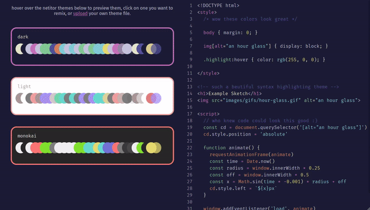

# netitor

[](https://standardjs.com)

A pedagogical web based code editor for creative netizens in training. You can play with a [live demo here](https://netizenorg.github.io/netitor/)

[](https://netizenorg.github.io/netitor/#code/eJy9WF1v6yYYvs+vYKkqtVVcf2AnkZtFOmmb2+1imrRLYpMEHcdkNumaM+2/DxvsGIxj5xxtqvwRwM/78PDwAl389PbL629//PoO9uyQLEeLnJ0TvBwBYD+B1Rn8TiJGM4LACme7P08kZ+DJFrWAf8KOeWjbEY3xEafPhNofJNqoLZ/A3/wOwIZ+Wjn5RtJdyN+zGGcWL3rhdf+MRkV1fJ6MQElDfrHHZLdnIXAd5/6lLPmLxGzfLNig6Osuo6c0DsHdzH19X81rxOcIpR8ol2BHmhNGaBqCDCeIkQ8sEBg9csBA4h1QtiO8DTox+qKQgIFz/FRYNEqu0sj3OEkm9ZsV0eO5RQptcpqcmJGUgr5ev65njqwQMmYoJqc8BIFzX14uPhSXXcgExE2U6HAWOaAd5opwAJRYu+KJU/Zw97ZaeVMHBPcTwDKU5keU8XLgPE5uaNuKxkefB4NctfLWqr+o4QBnAtwZb1jcNCmldgnelt64V8fJ17wyq35/s0ga408OruE1BySTjvNuRg0uqAeMGL+TNMI941ybS4OHZn8H/goGXUOvlEtxuIA8HInBXeAXf0qbDWWMHpqtGuOn9WaAXT1fUpCx/ftBfWxJFqZsb0V7ksQP7mOdOwRVpxnBcvsRPB2h9ovAcPoAoA4AbwTwdQA/UHVqdiJHCYrBc4LR9jud4xmThrdarWfrq0mDTzl7yp9T8a5zGpKvNAPAnjk07ei5yQBlAF+VvpqjpWu3NOPaZpQhhh+sqRPj3WMfuqega86os68B3h8EDxV4Sx12CH8UvmWsmrFMYhbs7sKwEEGnd6sQ3mxwCA6AGMV59TbQ4LprzAZ/mwYwgNdSo0bilvV3oJ9nxkDy7VpWU+P4w1BU83pQwZgPw1AdqiRXKbOAwOfi86JicvlZWmCIjtDVhJurus1NA2pYr1prnWntFdx43AZToXMPVSX6drvt99JFFWVH4sNWm6ZUcuZAr9WKk76Wj/o2On6bm9Lxym2eo85hb64Bu9r4uPM2VYyyQVNI64QF9V4EWi8C484HfnmD71+MQzIv16sgKFcxu3g6ZVkNZEiwUEtNB3pi+z5/VClQnWl+S71AU6/OV4K3WMmubswkcte27CKBNEJ/Q6lVtb674uqYRaUkG8KGZcnaPpLN9EY92jtY81nKPN1LmmG4wXyA8aRRgrYMVxbtRBxywLySAJTgMlZEU8blD8F4LABikh8TdOZn3oRGX1/6BbVm2pxxDTGb3fuhkJWtrakatd6dL2z5H4HRIiYfIEpQnv88Fkfr8bLg1CwvD1Tj5cLmZUutrtgfj5dlDKW42DA3Pvnvao2syp2PgVaxFepE/n8qjXyr5dxAWVR1ot9abZarPjF3jHKxQBjl3FaDr4XlS4nCSWd1vFIr3Kt2ydy7MjuZCXx3BLPLi7WkQ5ty8tZ14vEvbE1oAg==)

# How To...
- [...use it](https://github.com/netizenorg/netitor#use-it)
- [...incorporate it](https://github.com/netizenorg/netitor#include-it)
  - [netitor: properties](https://github.com/netizenorg/netitor#properties)
  - [netitor: methods](https://github.com/netizenorg/netitor#methods)
  - [netitor: events](https://github.com/netizenorg/netitor#events)
- [...contribute](https://github.com/netizenorg/netitor#contribute)

# Use It

The netitor is the core editor used in our online hypermedia creative coding educational platform [netnet.studio](https://netnet.studio), but you can use a much simpler version of the editor in the [online demo](https://netizenorg.github.io/netitor/) hosted on this repo. What makes the netitor unique to other code editors is that it's made specifically for beginners learning/experimenting with web code (HTML, CSS and JavaScript). For this reason (in addition to the usual code editor features like syntax highlighting and code hinting) it has some extra features designed to help beginners like friendly error messages (not only for JavaScript, but for HTML and CSS as well) and built-in edu info (you can double click on any piece of code in the editor to learn more about it). As an online + realtime editor it's purpose is not so much to replace professional code editors used to create larger projects, but rather quickly experiment, demonstrate concepts and share ideas (we're not trying to recreate the wheel, but create "training wheels" instead).

You can double click any pieces of code in the [online demo](https://netizenorg.github.io/netitor/) to view it's edu-info. Anytime there are errors or potential issues in your code, the editor will add a little dot on the line the issue appears, you can click on that dot to view the issue written in beginner friendly language. You can press `Ctrl+S` (or `Cmd+S` on Mac) to "save" anything you make in the online editor. This will encode everything you currently have in the editor into your browser's address bar. You can then copy+paste the updated URL from the address bar to share your code sketch with anyone else. 

# Include It

If you'd like to include it into your own online project (maybe to share interactive beginner friendly examples on your own personal website?) you can download minified and unminified versions of the library from the [build folder](https://github.com/netizenorg/netitor/tree/master/build) of this repo and import it in your own HTML file as one does, for example: `<script src="netitor.min.js"></scrip>`

The [index.html](https://github.com/netizenorg/netitor/blob/master/index.html) in the root of the directory is a working example of how to implement the netitor. The first thing you need to do is instantiate a new instance of `Netitor`. The constructor requires an options object with query selector string of an element in your HTML page, like:

```js
// assuming there's something like a <div id="editor"></div> on your page
const ne = new Netitor({
  ele: '#editor'
})
```

there are a series of additional optional arguments you can pass.

```js
const ne = new Netitor({
  ele: '#editor',
  render: '#output',
  code: '<h1> example code here </h1>',
  theme: 'dark',
  background: true,
  wrap: false,
  language: 'html',
  lint: true,
  hint: true,
  readOnly: false,
  displayTitle: false,
  autoUpdate: true,
  updateDelay: 500,
  friendlyErr: true,
  renderWithErrors: false
})
```

| property | default | description |
|:---:|:---:|:---:|
| render | none | query selector string of an element to display the realtime  code output in
| code | none | initial code to include in the editor
| theme | dark | syntax highlight theme to use
| background | true | if false, background will be transparent
| wrap | false | whether long lines should wrap or scroll
| language | html | can be html, css or javascript
| lint | true | whether or not to check for errors in realtime
| hint | true | whether or not to display autocomplete menus
| readOnly | false | whether the code is editable or read-only
| displayTitle | false | whether or not to apply content of title element to the browser tab
| autoUpdate | true | whether or not to update the render preview when code changes
| updateDelay | 500 | how many milliseconds to wait after code changes before preview updates
| friendlyErr | true | whether or not to translate default error messages into beginner friendly vernacular (when available)
| renderWithErrors | false | whether or not the output should render if there is an error in the editor

## Properties

all of these options can be changed at any point by reassigning the property of the same name:

```js
ne.code = '<h1> some other code </h1>'
ne.theme = 'monokai' // or 'light' or 'dark'
ne.background = false
ne.wrap = true
ne.language = 'css'
ne.lint = false
ne.hint = false
ne.displayTitle = true
ne.autoUpdate = false
ne.updateDelay = 2000
ne.friendlyErr = false
ne.renderWithErrors = true
```

There is also

### read-only properites

Netitor is a fully static web-based editor, as such it allows you to save and load code sketches to the URL (no database or back-end needed to save/share/remix/etc), in order to check if the current URL has a hash with code/data in it you can use `ne.hasCodeInHash`, this read-only property returns either `true` or `false`

You can check to see if the code in the editor is "tidy" (aka property formatted/indented) by calling `ne.isTidy`.

## Methods

```js
ne.tidy()
ne.getLine(num)
ne.update()

// highlighting/marking lines
ne.highlight(lines, color)
ne.spotlight(lines, transition)
ne.marker(line, color, cb)

// saving/loading sketches to/from URL
ne.generateHash()
ne.saveToHash()
ne.loadFromHash()

// adding custom root URL for any relative paths
ne.addCustomRoot(root)

// adding exceptions to internal linting system
ne.addErrorException(obj, specific)
ne.removeErrorException(obj, specific)
ne.clearErrorExceptions()

// adding custom elements data to edu info
ne.addCustomElements(obj)
ne.addCustomAttributes(obj)

// event listening
ne.on('event-name', callbackFunction)
ne.remove('event-name', callbackFunction)
```

**getLine(num)**: takes a number and returns the code on that particular line.

**update()**: if the `autoUpdate` is set to `false` you can control when you want the preview window to update yourself by calling: `ne.update()`

**highlight(lineNumber, color)**: this method will highlight a line of code in the editor. It requires a number as it's first argument (the line you want to highlight) with a CSS color string as an optional second argument (the default color is a translucent red), for example `ne.highlight(3, 'green')` will highlight the third line in the netitor with the color green. Alternatively, you can pass an options argument like this:
```js
  ne.highlight({
    startLine: 2, // the line to start highlighting
    startCol: 4, // the column on that line to start at
    endLine: 4, // the line to end highlighting
    endCol: 4, // the column on that line to end at
    color: 'green' // the highlight color
  })
```  
To remove all the highlights run `ne.highlight(null)` or `ne.highlight()` with no arguments.

**spotlight(lines, transition)**: this method will spotlight a line (or lines if passed an array of line numbers) of code in the editor. This means all other lines will fade their opacity while the spotlighted lines remain visible. You can change the transition of the spotlighting speed and ease by passing an optional transition string, the default is `'opacity 500ms cubic-bezier(0.165, 0.84, 0.44, 1)'`. To remove a spotlight run `ne.spotlight(null)` or `ne.spotlight()`.

**marker(lineNumber, color, callback)**: this method will add a marker (a circle) in the gutter (where the line numbers are) in the specified line (default color is red). The optional callback function will fire when the marker is clicked. To remove all the markers run `ne.marker(null)` or `ne.marker()` with no arguments.

**generateHash()**: this method will take the code currently in the editor and generate an encoded/compressed version of it that can be added to URL as a hash (similar to `saveToHash` except it returns the hash rather than updating the URL).

**saveToHash()**: this method will take all the code currently in the editor and save an encoded/compressed version of it to the current site's URL hash.

**loadFromHash()**: if the current site's URL hash has encoded/compressed code in it (which you can check for using `ne.hasCodeInHash`) this will decode the URL and load the data into the editor.

**loadFromURL(url)**: if you have some example code saved online somewhere (with CORS enabled) this method will send a fetch request for that code and load it up in the editor.

**tidy()**: calling this method will clean-up (aka format) the code in the editor (fix spacing, indentation, etc).

**addCustomRoot(root)**: netitor is a single page editor for simple HTML sketches, which means sketches with code linking to other files/assets (via the `src` and `href` HTML attributes as well as the `url()` CSS function) will need to be absolute paths (as there is no 'relative' context). To get around this you can use this method to set a custom 'root' path. This should be a public URL to a directory with any of the files you want to reference in the editor as though they were relative paths. You can also pass this method `null` to reset it. In some cases you may notice these errors in your console `The resource from “YOUR_CUSTOM_ROOT” was blocked due to MIME type mismatch (X-Content-Type-Options: nosniff).`, this is due to the server's [response HTTP headers](https://developer.mozilla.org/en-US/docs/Web/HTTP/Headers/X-Content-Type-Options). This is most likely to happen when importing JS and CSS assets via `<script>` and `<link>`. If you don't have access to the server's code/config (and thus can't change the response headers to avoid this error) you can alternatively use a proxy URL ([as explained here](https://stackoverflow.com/a/41309463/1104148)) to get around the error. In order to add a custom proxy URL for these cases, you can alternatively pass an object with both a `base` URL and `proxy` URL property to this method.

```js
  // simple way
  ne.addCustomRoot('https://mysite.com/project/')
  // adding both a custom base URL and a proxy URL
  // for reasons explained above
  ne.addCustomRoot({
    base: 'https://mysite.com/project/',
    proxy: 'https://proxy-server.com/mysite.com/project/'
  })
  // to remove the custom root URL (reset back to default)
  ne.addCustomRoot(null)
```

**addErrorException(obj, specific)**: error objects returned in the event array passed into the `lint-error` callback function have a `type` property which returns either 'error' or 'warning' which can be used to filter out less consequential errors, but if there is a specific errors you want to suppress rather than doing that filtering yourself you can add it to the list of exceptions by passing the error object into this method. The second argument is an optional boolean which determines whether or not you want to ignore this specific error (the default is false, which ignores every instance of that general error). For example, using an made-up HTML tag like `<fart>` will throw an "standard-elements" error, adding an ErrorException for this error **specifically** will avoid erroring on that particular tag, adding a general exception will prevent all future "standard-elements" errors.

**removeErrorException(obj, specific)**: very similar to `addErrorException()` except it removes an error exception (assuming it had previously been added).

**clearErrorExceptions()**: calling this method clears all the exceptions added using the `.addErrorException(obj)` method.

**addCustomElements(obj)**: the linting process (ie. generating error objects) includes flagging non-standard elements. This means if you're using any [custom elements](https://developer.mozilla.org/en-US/docs/Web/Web_Components) it will return errors when it spots them. This method is used to add exceptions for any custom elements you'd like to use in the editor. Additionally, when a user double-clicks on an custom element which has been added, the editor will fire an edu-info event for that element. The `obj` passed into this method should be a "dictionary" object with all the custom elements you'd like to add, it should look similar to [this](https://github.com/netizenorg/netitor/blob/master/src/edu-data/html-elements.json).

**addCustomAttributes(obj)**: assuming the custom element objects passed into `addCustomElements()` include 'attributes' arrays, it will use them to create very generic edu-info data for those attributes, but you could alternatively pass this method your own attribute "dictionary" object, similar to [this](https://github.com/netizenorg/netitor/blob/master/src/edu-data/html-attributes.json).

**on('event-name', callbackFunction)**: the netitor has a l(still working on it)ist of events you can listen for and pass a callback function to, for example:

```js
ne.on('code-update', (event) => {
  // this function will run every time the code in the editor changes
})
```

**remove('event-name', callbackFunction)**: can be used to remove an event listener

### events

**code-update**: This fires every time the code in the netitor changes. The `data` passed into the callback function is a string containing all the code currently in the editor (essentially the same as `ne.code`)

**render-update**: This fires every time the render output iframe is updated.

**cursor-activity**: This fires every time the users's cursor changes positions. It returns an event object which looks like this:
```js
{
  language: "html",
  line: 1,
  col: 2,
  selection: '<h1>hello'
  data: {
    type: "tag",
    token: "h1",
    tokenColStart: 1,
    tokenColEnd: 3,
    line: "<h1>hello world!</h1>"
  }
}
```
In the example above the user would have clicked (and thus placed their cursor) right in between the "h" and "1" on a line of code that looked like `<h1>hello world!</h1>`.

**lint-error**: Assuming you have `lint` set to `true`, if/when there are any errors in the netitor this callback will fire. The callback gets passed an array of error objects. These error objects vary a bit between languages but will all have at the very least the following properties:
```js
{
  type: "error", // or "warning"
  language: "html",
  message: "traditional error message in programmer lingo",
  friendly: "beginner friendly error message",
  line: 6, // line where the error was found
  col: 3 // column where the error was found
  // may contain other properties depending on the language
}
```

**edu-info**: Anytime you double-click on a piece of code in the netitor this callback will fire. The data object passed into the callback function will at the very least look this:
```js
{
  language: "html",
  data: "class",
  type: "attribute",
  line: 20,
  nfo: {…}
}
```
The `nfo` property will contain an object with educational/reference information as well as links to further resources on that particular piece of code. This may not always be available, it depends on whether the particular piece of code selected has additional info. This info is initially generated from our [eduscraper](https://github.com/netizenorg/eduscraper) (you can take a look at that repo to get a sense of the structure of the data) and later augmented by our "educustom" sript.

**hint-select**: This fires every time the user tabs up or down in the autocomplete hinting menu with the up/down arrow keys. The data object passed into the callback function contains the language of and the autocomplete option currently selected, an example might look like this:
```js
{
  language: "css",
  data: "color"
}
```

# Contribute

There are a few ways you can contribute to this project and support our development:
- [netizen.org](https://netizen.org) is a 501(c)3 tax deductible organization, so you might consider making a [donation](https://donorbox.org/netizen)! Your support helps ensure our tools and workshops remain accessible to folks from all backgrounds.
- did you find a potential bug in our code? please let us know by creating an [issue](https://github.com/netizenorg/netitor/issues) (or sending us an email hi@netizen.org)
- would you like to fix that bug yourself? Please feel free to "Fork" this project and submit a [PR](https://github.com/netizenorg/netitor/pulls) (Pull Request). See "Contributing Code" below for more details.
- want to create your own netitor theme? check out our [custom theme creator](https://netizenorg.github.io/netitor/theme/)

## Custom Theme Creator

[](https://netizenorg.github.io/netitor/theme/)

After creating and downloading a custom theme you've made with the [theme creator](https://netizenorg.github.io/netitor/theme/) add it to the `src/css/themes/` folder of your forked version of this repo, push your updates and submit a [PR](https://github.com/netizenorg/netitor/pulls)!

## Contributing Code

If you'd like to contribute some code, bug fixes, IMPROVEMENTS etc, fork/clone the repo and make sure to download the dependencies: `npm install`

The general workflow we use looks like this:
  - make some changes
  - run the build script `npm run build`
  - test your changes using the example/demo page [`index.html`](https://github.com/netizenorg/netitor/blob/master/index.html)
  - (optionally u can also run the watch script `npm run watch` just before you start dev'n, to avoid having to run the build script manually every time you make change)

The vast majority of the code is in [`src/main.js`](https://github.com/netizenorg/netitor/blob/master/src/main.js) you'll notice that netitor makes heavy use of a library called [CodeMirror](https://codemirror.net/) (which is used by the vast majority of web based code editors we've inspected), you can check out their [documentation here](https://codemirror.net/doc/manual.html). Other files/folders to be aware of are:
  - [`src/css/`](https://github.com/netizenorg/netitor/tree/master/src/css): this directory contains all of the editor's styles (including it's various syntax highlight themes)
  - [`src/edu-data/`](https://github.com/netizenorg/netitor/tree/master/src/edu-data): this directory contains all the logic and data used to explain code in the editor (the info contained in the 'edu-info' event object returned by the event listener every time you double clicking on a piece of code). The `.json` files in this folder are automatically generated by running the `npm run eduscraper` (see [eduscraper](https://github.com/netizenorg/eduscraper) for more info), with the exception of the `.json` files inside `edu-data/custom/` (which are written by hand)
  - [`src/hinters/`](https://github.com/netizenorg/netitor/tree/master/src/hinters): this directory contains all the logic used to create the auto-complete code-hinting lists
  - [`src/linters/`](https://github.com/netizenorg/netitor/tree/master/src/linters): this directory contains all the logic used to create the friendly error messages the 'lint-error' event object returned by the event listener every time the netitor spots an issue in the code.
  - [`src/prependProxyURL.js`](https://github.com/netizenorg/netitor/blob/master/src/prependProxyURL.js) this handles applying the proxy URLs to necessary paths when the `addCustomRoot()` [method](https://github.com/netizenorg/netitor#methods) is used.
  - [`index.html`](https://github.com/netizenorg/netitor/blob/master/index.html): this is the live demo page
  - [`theme/`](https://github.com/netizenorg/netitor/tree/master/theme) this is the live theme creator app


There are a few different npm scripts used in the development process:
  - `npm run build`: this is the script that creates (compiles) the library files itself (and places them in the `build/` directory).
  - `npm run watch`: runs a watch script which automatically runs the build script anytime changes to JavaScript files are made.
  - `npm run lint`: we're using [Standard.js](https://standardjs.com/) as our code style, so it's best to run the linter to check and make sure everything is up to par before submitting any PRs (NOTE: this runs automatically when you run the build script).
  - `npm run compile-css`: this script compiles any chagnes made to the `.js` files used to create the `.css` files (NOTE: this runs automatically when you run the build script).
  - `npm run eduscraper`: runs the eduscraper and updates all the edu data in `src/edu-data` (see note below)
  - `npm run update-eduscraper`: updates the eduscraper (see note below)
  - `npm run educustom`: adds custom (hand written) edu data to the `.json` files generated by the eduscraper (see note below)


**a note on the eduscraper**

Anything having to do with `edu-data` is arguably the most precarious part of the process. That said, it's not very often that this data will need to be updated and so it's not super liekly we need to rerun the eduscraper all that much. That said, here some important things to know for the next time we do end up needing to run this.

Most of the educational info/data stored in the `src/edu-data/*.json` files are automatically generated by the [eduscraper](https://github.com/netizenorg/eduscraper). The npm script `npm run eduscraper` is set to update *ALL* of the data by default (it's an alias for `eduscraper all src/edu-data`), but there will be times we only want to update part of the data, as documented in the eduscraper's [README](https://github.com/netizenorg/eduscraper) this can be edited to update only specific parts of the edu-data like `eduscraper attributes src/edu-data` or `eduscraper colors src/edu-data` for example.

Because of the nature of the Web (it's always changing) scrapers constantly have to be updated, the eduscraper is no exception. For this reason there's a script `npm run update-eduscraper` which will update this dependency and should be run anytime the [eduscraper](https://github.com/netizenorg/eduscraper) repo has been udpated.
